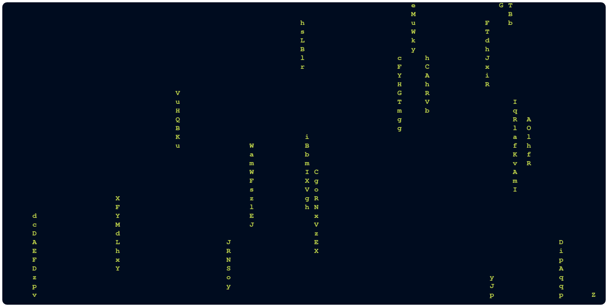

<div align="center">
    <h1>Matrix</h1>
    
</div>

# What's that
Matrix as the name say, is a matrix effect for Linux terminal written in Python, supporting terminal window's resize

# Executing
With no secrets you just need to run the program in a Python3 interpreter, like in the following example

```sh
python3 main.py
```

# Costumizing the matrix
This matrix has some costumizations, for string size and foreground/background colors, all of them passed by program call arguments


## Foreground colors
To change the color of foreground use the following command:
```txt
--foreground-color or -f
```

## Background colors
To change the color of background use the following command:
```txt
--background-color or -b
```

# Colors cheatsheet
All colors available in matrix is right here, follow the list:
<ul>
    <li>black</li>
    <li>red</li>
    <li>green</li>
    <li>yellow</li>
    <li>blue</li>
    <li>magenta</li>
    <li>cyan</li>
    <li>gray</li>
    <li>bright_red</li>
    <li>bright_green</li>
    <li>bright_yellow</li>
    <li>bright_blue</li>
    <li>bright_magenta</li>
    <li>bright_cyan</li>
    <li>bright_white</li>
</ul>

# Changing matrix string size
Useful for different sizes of terminal's window, this feature give you the possibility to change the string length of the falling strings

## Changing the min size
To change the min size of falling strings use the CLI command below
```txt
--min-string-size or -M
```

## Changing the max size
To change the max size of falling strings use the CLI command below
```txt
--max-string-size or -M
```